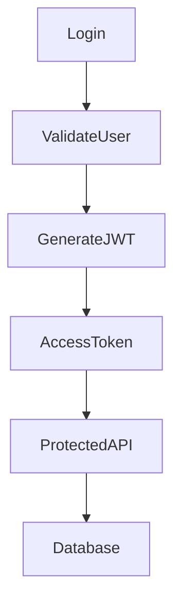
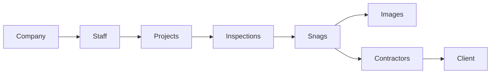
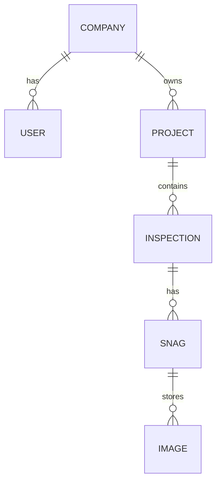

````markdown
# 🚀 SnagPro Backend

A robust **Django REST Framework** backend powering the **SnagPro Construction Snagging & Inspection Management System**.

The backend provides secure REST APIs for authentication, company management, project management, inspections, snag tracking, staff management, and role-based access control using JWT authentication.

---

# 🌐 Live API

Backend API

https://snagpro-backend.onrender.com

---

# 📖 About

The SnagPro backend is designed to support construction companies in managing projects, inspections, defects (snags), contractors, engineers, and clients through a secure REST API.

It provides scalable APIs with role-based authorization, JWT authentication, PostgreSQL database integration, media upload support, and deployment-ready architecture.

---

# 🎯 Objectives

- Secure REST APIs
- JWT Authentication
- Company-based multi-user system
- Project Management
- Inspection Management
- Snag Tracking
- Staff Management
- Contractor Assignment
- Client Access
- PostgreSQL Database
- Production Ready Deployment

---

# ✨ Features

- 🔐 JWT Authentication
- 👨‍💼 Company Admin Management
- 👷 Engineer Management
- 🔨 Contractor Management
- 👤 Client Management
- 🏗 Company Registration
- 📁 Project CRUD APIs
- 📋 Inspection CRUD APIs
- 🚧 Snag CRUD APIs
- 📷 Image Upload Support
- 👤 Profile Management
- 🔑 Change Password API
- 🛡 Role-Based Permissions
- 📦 PostgreSQL Database
- 🌍 CORS Enabled
- ☁️ Render Deployment Ready

---

# 🏗 Backend Architecture

```mermaid
graph TD

Client

--> DjangoAPI

DjangoAPI

--> JWT Authentication

JWT Authentication

--> Permission Classes

Permission Classes

--> Business Logic

Business Logic

--> PostgreSQL Database

Business Logic

--> Media Storage
```

---

# 🔐 Authentication Flow



---

# 📋 Application Workflow



---

# 🗄 Database Structure



---

# 🛠 Tech Stack

## Backend

- Python
- Django
- Django REST Framework
- JWT Authentication
- Gunicorn

## Database

- PostgreSQL
- Neon Database

## Deployment

- Render

## Libraries

- Django REST Framework
- Simple JWT
- Pillow
- WhiteNoise
- dj-database-url
- python-decouple
- psycopg2-binary

---

# 📂 Project Structure

```text
backend/

├── accounts/
├── companies/
├── projects/
├── snags/
│
├── config/
│
├── media/
├── staticfiles/
│
├── manage.py
├── requirements.txt
├── Procfile
└── README.md
```

---

# 🚀 Installation

Clone Repository

```bash
git clone https://github.com/Hanumanth88600/snagpro-backend.git
```

Move into project

```bash
cd snagpro-backend
```

Create Virtual Environment

```bash
python -m venv venv
```

Activate Environment

### Windows

```bash
venv\Scripts\activate
```

### Linux / macOS

```bash
source venv/bin/activate
```

Install Dependencies

```bash
pip install -r requirements.txt
```

Create Environment Variables

Create a `.env` file

```env
SECRET_KEY=your_secret_key

DEBUG=True

DATABASE_URL=your_database_url
```

Run Migrations

```bash
python manage.py migrate
```

Run Development Server

```bash
python manage.py runserver
```

---

# 🔐 Authentication

Authentication is implemented using **JWT**.

Login Endpoint

```
POST /api/accounts/login/
```

Returns

- Access Token
- Refresh Token
- User Information

Protected APIs require:

```
Authorization: Bearer <access_token>
```

---

# 📡 Main API Modules

## Accounts

- Login
- Profile
- Update Profile
- Change Password
- Staff CRUD

## Companies

- Company CRUD

## Projects

- Project CRUD

## Inspections

- Inspection CRUD

## Snags

- Snag CRUD
- Image Upload

---

# 🌍 Deployment

Backend

- Render

Database

- Neon PostgreSQL

Static Files

- WhiteNoise

WSGI Server

- Gunicorn

---

# 🔗 Frontend Repository

https://github.com/Hanumanth88600/snagpro-frontend

---

# 👨‍💻 Developed By

**Hanumanth H**

MCA Graduate

Python Full Stack Developer

---

# 📫 Connect With Me

### LinkedIn

https://www.linkedin.com/in/hanumanthappah-3759b4367/

### GitHub

https://github.com/Hanumanth88600

### Email

hanumanthappah5258@gmail.com

---

# ⭐ Support

If you found this project useful, please consider giving it a ⭐ on GitHub.

---

# 📄 License

This project is developed for educational, learning, and portfolio purposes.
````
