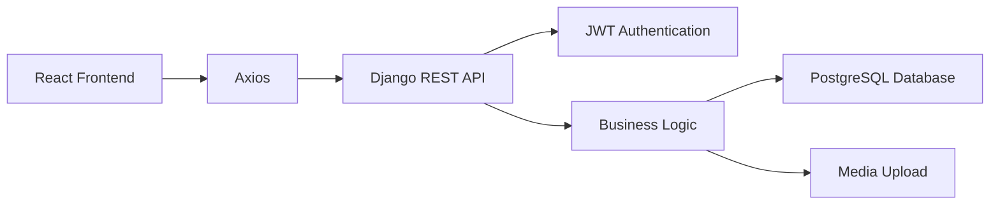
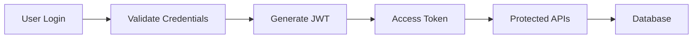
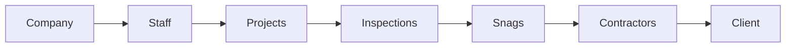
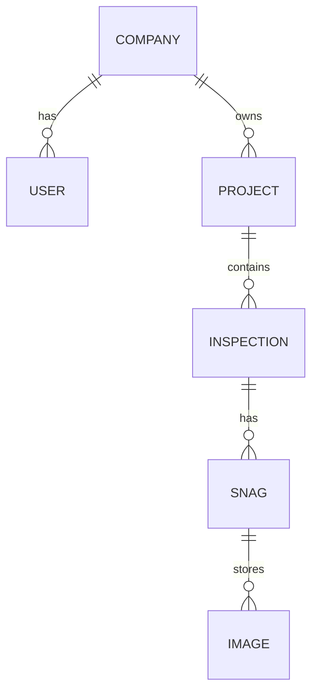

# 🚀 SnagPro Backend

<p align="center">

A robust <strong>Django REST Framework</strong> backend powering the <strong>SnagPro Construction Snagging & Inspection Management System</strong>.

</p>

<p align="center">


</p>

---

# 🌐 Live API

**Backend URL**

https://snagpro-backend.onrender.com

---

# 📖 About

**SnagPro Backend** provides secure REST APIs for managing construction projects, inspections, snags, contractors, engineers, and clients.

It is built with **Django REST Framework**, secured using **JWT Authentication**, connected to a **PostgreSQL (Neon)** database, and deployed on **Render**.

---

# 🎯 Objectives

* 🔐 Secure REST APIs
* 🏗 Company-based Project Management
* 👷 Staff & Contractor Management
* 📋 Inspection Management
* 🚧 Snag Tracking
* 📷 Image Upload Support
* 📊 Scalable Architecture
* ☁️ Cloud Deployment

---

# ✨ Features

* 🔐 JWT Authentication
* 👨‍💼 Company Admin Management
* 👷 Engineer Management
* 🔨 Contractor Management
* 👤 Client Management
* 🏢 Company Registration
* 📁 Project CRUD APIs
* 📋 Inspection CRUD APIs
* 🚧 Snag CRUD APIs
* 📷 Image Upload
* 👤 Profile Management
* 🔑 Change Password
* 🛡 Role-Based Permissions
* 🗄 PostgreSQL Database
* 🌍 CORS Enabled
* ☁️ Render Deployment Ready

---

# 🏗 System Architecture



---

# 🔐 Authentication Flow



---

# 📋 Application Workflow



---

# 🗄 Database Structure



---

# 🛠 Tech Stack

| Category             | Technologies          |
| -------------------- | --------------------- |
| **Language**         | Python                |
| **Framework**        | Django                |
| **API**              | Django REST Framework |
| **Authentication**   | JWT (Simple JWT)      |
| **Database**         | PostgreSQL (Neon)     |
| **Deployment**       | Render                |
| **WSGI**             | Gunicorn              |
| **Static Files**     | WhiteNoise            |
| **Media Processing** | Pillow                |

---

# 📂 Project Structure

```text
backend/

├── accounts/
├── companies/
├── projects/
├── snags/
├── config/
├── media/
├── staticfiles/
├── manage.py
├── requirements.txt
├── Procfile
└── README.md
```

---

# 🚀 Installation

### Clone Repository

```bash
git clone https://github.com/Hanumanth88600/snagpro-backend.git
```

### Navigate to Project

```bash
cd snagpro-backend
```

### Create Virtual Environment

```bash
python -m venv venv
```

### Activate Environment

**Windows**

```bash
venv\Scripts\activate
```

**Linux / macOS**

```bash
source venv/bin/activate
```

### Install Dependencies

```bash
pip install -r requirements.txt
```

### Create `.env`

```env
SECRET_KEY=your_secret_key

DEBUG=True

DATABASE_URL=your_database_url
```

### Apply Migrations

```bash
python manage.py migrate
```

### Run Server

```bash
python manage.py runserver
```

---

# 🔐 Authentication

The backend uses **JWT Authentication**.

### Login Endpoint

```http
POST /accounts/login/
```

### Response

* Access Token
* Refresh Token
* User Information

### Protected Requests

```http
Authorization: Bearer <access_token>
```

---

# 📡 API Modules

| Module      | Features                                    |
| ----------- | ------------------------------------------- |
| Accounts    | Login, Profile, Change Password, Staff CRUD |
| Companies   | Company CRUD                                |
| Projects    | Project CRUD                                |
| Inspections | Inspection CRUD                             |
| Snags       | Snag CRUD, Image Upload                     |

---

# 🌍 Deployment

| Service      | Platform        |
| ------------ | --------------- |
| Backend      | Render          |
| Database     | Neon PostgreSQL |
| Static Files | WhiteNoise      |
| WSGI Server  | Gunicorn        |

---

# 🔗 Frontend Repository

https://github.com/Hanumanth88600/snagpro-frontend

---

# 👨‍💻 Developed By

**Hanumanth H**

🎓 MCA Graduate

💻 Python Full Stack Developer

---

# 📫 Connect With Me

**LinkedIn**

https://www.linkedin.com/in/hanumanthappah-3759b4367/

**GitHub**

https://github.com/Hanumanth88600

**Email**

[hanumanthappah5258@gmail.com](mailto:hanumanthappah5258@gmail.com)

---

# ⭐ Support

If you found this project useful, please consider giving it a ⭐ on GitHub.

---

# 📄 License

This project is developed for **educational, learning, and portfolio purposes**.
